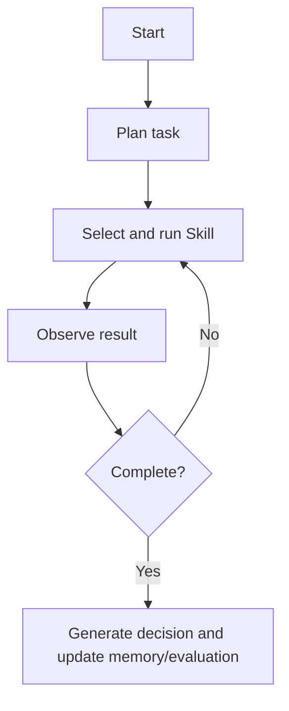

# Warehouse Operation Copilot

Warehouse Operation Copilot is an AI decision platform MVP for frontline warehouse operations. The backend uses **FastAPI + LangGraph**, and the frontend uses **React + Vite**. The system connects order, inventory, labor, and equipment data to support task decomposition, data processing, simulation, anomaly diagnosis, equipment control, decision memory, and evaluation loops.

## Core Capabilities

- Layered and decoupled architecture: perception layer, cognition layer, Skills layer, MCP/WMS interaction layer, memory layer, and evaluation layer.
- LangGraph ReAct orchestration: plan, act, observe, route, and summarize.
- Four standardized operation Skills:
  - Data Processing: aggregate order, inventory, labor, and equipment KPIs.
  - Simulation: estimate capacity, SLA risk, and resource gaps.
  - Anomaly Diagnosis: identify root causes across inventory, orders, and equipment.
  - Equipment Control: generate safe control recommendations and block high-risk actions.
- MCP safety boundary: simulated WMS read/write allowlist, risk levels, and audit logs.
- Evaluation loop: task completion rate, solution adoption rate, average response time, and automation coverage rate.

## Project Structure

```text
.
├── backend
│   ├── app
│   │   ├── agent          # LangGraph ReAct orchestration
│   │   ├── data           # Local warehouse sample data
│   │   ├── services       # MCP, memory, and evaluation services
│   │   ├── skills         # Four operation Skills
│   │   ├── main.py        # FastAPI entry point
│   │   └── models.py      # API data models
│   ├── requirements.txt
│   └── smoke_test.py
├── docker
│   ├── Dockerfile.backend
│   ├── Dockerfile.frontend
│   ├── docker-compose.yml
│   ├── nginx.conf
│   └── README.md
├── docs
│   └── PRD.md
└── frontend
    ├── src
    │   ├── App.tsx
    │   ├── main.tsx
    │   └── styles.css
    └── package.json
```

## Local Run

### 1. Start the backend

Open PowerShell in the backend directory, install dependencies, and start FastAPI:

```powershell
cd "\warehouse-operation-copilot\backend"
pip install -r requirements.txt
python -m uvicorn app.main:app --reload --port 8000
```

Backend URL: <http://localhost:8000>

API docs: <http://localhost:8000/docs>

### 2. Start the frontend

Open another PowerShell in the frontend directory, install dependencies, and start Vite:

```powershell
cd "\warehouse-operation-copilot\frontend"
npm install
npm run dev
```

Frontend URL: <http://localhost:5173>

> Do not run `npm run dev` from the repository root. The Vite scripts are defined in `frontend/package.json`.

## Docker Run

Docker assets are maintained in the standalone [docker](docker) folder.

From the repository root, build and start both services:

```powershell
docker compose -f docker/docker-compose.yml up --build
```

Docker URLs:

- Frontend: <http://localhost:5173>
- Backend API: <http://localhost:8000>
- Backend API docs: <http://localhost:8000/docs>

Stop the Docker stack:

```powershell
docker compose -f docker/docker-compose.yml down
```

For more details, see [docker/README.md](docker/README.md).

## Example Questions

- Will today's outbound peak create shipment delays? Provide a staffing and wave planning recommendation.
- Which SKUs are below safety stock, and how should replenishment be prioritized?
- Sorter throughput is dropping. Diagnose the root cause and recommend equipment actions.
- Will AGV congestion affect SLA? Should routing or speed settings be adjusted?

## API Overview

| Method | Path | Description |
| --- | --- | --- |
| GET | `/api/health` | Health check |
| GET | `/api/dashboard` | Warehouse operation snapshot |
| POST | `/api/agent/run` | Run an agent task |
| GET | `/api/memory` | Decision memory |
| GET | `/api/evaluations` | Evaluation metrics |
| POST | `/api/evaluations/adoption` | Update solution adoption status |

## LangGraph Flow



## Extension Guide

### Add a new Skill

1. Add a new Skill file under `backend/app/skills`.
2. Expose a function that takes context or `AgentState` and returns structured results.
3. Register the Skill in `backend/app/agent/graph.py`.
4. Add trigger rules in the planner.

### Connect a real WMS

1. Replace the data access implementation in `backend/app/services/wms_mcp.py`.
2. Keep the `McpPolicy` allowlist and risk-level checks.
3. Forward audit logs to the enterprise logging platform.

### Connect an LLM

The current MVP supports offline demo mode without an LLM key. A future version can connect an enterprise LLM in the planner and final-answer nodes while keeping LangGraph state and Skill outputs as controlled context.

## Product Document

The PRD is available at [docs/PRD.md](docs/PRD.md).
