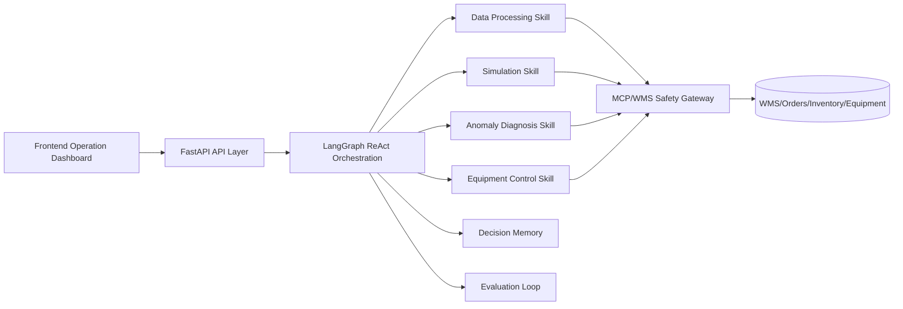

# Warehouse Operation Copilot PRD

## 1. Background

Frontline warehouse operations often suffer from disconnected order, inventory, labor, equipment, simulation, and WMS data. Operational decisions rely heavily on a small group of experts, while exceptions are often handled reactively after the issue has already affected throughput, SLA, or labor utilization.

This product builds an **AI decision platform for frontline warehouse operations**. It uses LangGraph as the agent orchestration framework, LLM/ReAct as the cognition pattern, standardized operation Skills for deterministic execution, MCP as the secure WMS interaction boundary, and decision memory for continuous learning.

## 2. Goals and Scope

### 2.1 Product Goals

1. Connect order, inventory, equipment, and labor data to reduce data silos.
2. Use the ReAct pattern to dynamically decompose frontline operation questions.
3. Standardize four operation Skills: data processing, simulation, anomaly diagnosis, and equipment control.
4. Use an MCP safety gateway for WMS interaction with read/write boundaries, auditability, and risk control.
5. Build an evaluation loop around task completion rate, solution adoption rate, and average response time.

### 2.2 MVP Scope

The current version is a runnable MVP that includes:

- Backend: FastAPI + LangGraph agent orchestration.
- Frontend: Vite + React + TypeScript operation dashboard.
- Simulated WMS/MCP: local data and action allowlist.
- Four Skills: data processing, simulation, anomaly diagnosis, and equipment control.
- Memory and evaluation: local JSON persistence.

## 3. User Personas

| User | Need | Typical Task |
| --- | --- | --- |
| Warehouse Supervisor | Identify bottlenecks and create staffing or equipment plans quickly | “Will today's outbound peak overload the operation?” |
| Shift Lead | Locate root causes and actions after an exception occurs | “Why did sorter throughput drop?” |
| Operations Expert | Review strategy effectiveness and capture reusable playbooks | “Did the last replenishment strategy reduce congestion?” |
| IT/WMS Administrator | Safely connect WMS and prevent unauthorized control actions | “Which actions require approval?” |

## 4. Core Scenarios

### 4.1 Peak Capacity Warning

The agent reads order peaks, inventory, labor, and equipment status, calculates capacity gaps, simulates candidate strategies, estimates SLA impact, and recommends sorter, wave, and staffing actions.

### 4.2 Inventory Anomaly Diagnosis

When inventory falls below safety stock or SKU turnover becomes abnormal, the agent traces order structure, coverage days, and replenishment rhythm, then returns root causes and recommended actions.

### 4.3 Equipment Control Recommendation

For AGVs, conveyors, sorters, and other equipment, the agent recommends speed mode, routing, or maintenance actions. High-risk actions are returned as approval-required recommendations rather than direct execution.

### 4.4 Decision Memory and Reuse

Each task stores the question, decision, confidence signals, adoption status, and outcome metrics so similar future cases can reuse prior experience.

## 5. Functional Requirements

### 5.1 Perception Layer

- Ingest order, inventory, labor, and equipment data.
- Provide a unified operation snapshot API.
- Support local sample data in the MVP and allow replacement with WMS/MES/IoT sources later.

### 5.2 Cognition Layer

- Use LangGraph to build the task flow: plan, act, observe, route, and summarize.
- Support ReAct loops where the agent chooses the next Skill based on observations.
- Return transparent task state and step-by-step reasoning traces.

### 5.3 Skills Layer

| Skill | Capability | Output |
| --- | --- | --- |
| Data Processing | Aggregate order, inventory, labor, and equipment KPIs | Operation metrics and risk signals |
| Simulation | Run lightweight capacity simulations for candidate strategies | Strategy impact, SLA risk, and resource gaps |
| Anomaly Diagnosis | Identify root causes across inventory, order, and equipment data | Root causes, impact, and handling recommendations |
| Equipment Control | Generate equipment parameters or maintenance recommendations | Safe actions, approval level, and expected benefit |

### 5.4 MCP/WMS Safety Interaction

- All WMS access goes through the MCP-style client.
- Read operations are allowed by default for approved resources; write operations use an allowlist and risk levels.
- High-risk control actions return `approval_required` and are not executed automatically.
- All actions are recorded in audit logs.

### 5.5 Memory Layer

- Store tasks, recommendations, metrics, and user adoption status.
- Support keyword-based retrieval of similar historical cases.
- Allow future replacement with a vector database.

### 5.6 Evaluation Loop

Core metrics:

- Task completion rate: completed tasks / total tasks.
- Solution adoption rate: adopted solutions / completed tasks.
- Average response time: average task response duration.
- Automation coverage rate: Skill-completed steps / total steps.

## 6. Non-Functional Requirements

- Keep the architecture layered and decoupled so Skills can be extended independently.
- Keep API response structures stable for frontend and external integrations.
- Support offline demo mode without an LLM key.
- Provide audit logs, safety blocking, and approval marks for write actions.
- Support large-screen operation dashboards and desktop browsers.

## 7. System Architecture

## 8. API Requirements

| Method | Path | Description |
| --- | --- | --- |
| GET | `/api/health` | Health check |
| GET | `/api/dashboard` | Get operation snapshot |
| POST | `/api/agent/run` | Run an agent task |
| GET | `/api/memory` | View decision memory |
| GET | `/api/evaluations` | View evaluation metrics |
| POST | `/api/evaluations/adoption` | Update solution adoption status |

## 9. Acceptance Criteria

1. Users can enter an operation question in the frontend and receive a structured decision.
2. The backend LangGraph flow can dynamically call at least two Skills based on the task.
3. The frontend displays operation KPIs, task traces, recommended actions, risk levels, and evaluation metrics.
4. Equipment control actions pass through MCP safety checks, and high-risk actions are not executed directly.
5. The README provides local startup steps, project structure, and extension guidance.

## 10. Future Iterations

- Connect real WMS, TMS, WCS, and IoT data.
- Connect enterprise LLMs and a vector database.
- Add Plant Simulation/SimTalk integration.
- Add human approval workflows and permission models.
- Add A/B tests and online strategy benefit tracking.